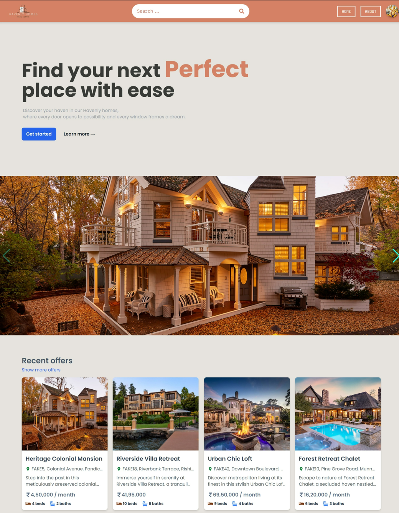

<div align="center">
<h3 align="center">Real Estate app using MERN and tailwind css</h3>
      
  <br />

  <!-- <div>
    
  </div> -->
</div>

## 📋 <a name="table">Table of Contents</a>

1. 🤖 [Introduction](#introduction)
2. ⚙️ [Tech Stack](#tech-stack)
3. 🔋 [Features](#features)
4. 🤸 [Quick Start](#quick-start)
5. 🕸️ [Snippets](#snippets)

## <a name="introduction">🤖 Introduction</a>

Welcome to Havenly Homes, your ultimate destination for finding your dream home!.

Havenly Homes is a full-stack real estate application built using the MERN stack. It offers a comprehensive set of features to help users find, explore, and interact with property listings effectively.It aims to provide users with a seamless and intuitive platform for finding their ideal homes and connecting with landlords or property owners.

## <a name="tech-stack">⚙️ Tech Stack</a>

- Frontend: React.js
- Backend: Node.js, Express.js
- Database: MongoDB
- Authentication: JSON Web Tokens (JWT), OAuth (Google Authentication)
- Image Upload: Firebase

## <a name="features">🔋 Features</a>

👉 **User Authentication**: 
  - Sign up and login functionality to access personalized features.
  - Authentication with Google for convenient login.

👉 **Property Listings**: 
  - Browse through a vast collection of property listings.
  - Search functionality to find homes based on location, price range, amenities, etc.
  - Sort listings based on various criteria such as price, size, and date listed.

👉 **Profile Management**: 
  - Update user profile information such as name, email, and contact details.
  - View and manage saved favorite listings.
  - Access personalized recommendations based on user preferences.

👉 **Create Listings**:
  - Create new property listings with detailed information including description, price, location, and images.
  - Upload images of properties to showcase them effectively.

👉 **Update Listings**: 
  - Edit and update existing property listings with updated information or images.
  - Maintain accurate and up-to-date property information for users.

👉 **Responsiveness**: 
  - Seamless adaptability across all devices, ensuring optimal viewing experience for every user.

## <a name="quick-start">🤸 Quick Start</a>

Follow these steps to set up the project locally on your machine.

**Prerequisites**

Make sure you have the following installed on your machine:

- [Git](https://git-scm.com/)
- [Node.js](https://nodejs.org/en)
- [npm](https://www.npmjs.com/) (Node Package Manager)

**Cloning the Repository**

```bash
git clone https://github.com/Aditya10403/HavenlyHomes.git
cd portfolio
```

**Installation**

Install the project dependencies using npm:

```bash
npm install
```

**Running the Project**

```bash
npm run dev
```

Open [http://localhost:3000](http://localhost:3000) in your browser to view the project.

## <a name="snippets">🕸️ Snippets</a>

<details>
<summary><code>vite.config.js</code></summary>

```javascript
import { defineConfig } from 'vite'
import react from '@vitejs/plugin-react'

// https://vitejs.dev/config/
export default defineConfig({
  server: {
    proxy: {
      '/api': {
        target: 'http://localhost:3000',
        secure: false,
      },
    },
  },
  
  plugins: [react()],
})
```

</details>

<details>
<summary><code>tailwind.config.js</code></summary>

```javascript
/** @type {import('tailwindcss').Config} */
export default {
  content: [
    "./index.html",
    "./src/**/*.{js,ts,jsx,tsx}",
  ],
  theme: {
    fontFamily: {
      normaltext: ["Poppins", "sans-serif"],
      funtext: ["Kode Mono", "monospace"],
    },
    extend: {},
  },
  plugins: [
    require('@tailwindcss/line-clamp'),
    //..
  ],
}


```

</details>

<details>
<summary><code>index.css</code></summary>

```css
@tailwind base;
@tailwind components;
@tailwind utilities;

html {
  scroll-behavior: smooth;
}

.emoji-404 {
  position: relative;
  animation: mymove 2.5s infinite;
}

@keyframes mymove {
  33% {
    top: 0px;
  }

  66% {
    top: 20px;
  }

  100% {
    top: 0px
  }
}

.swiper-button-next,
.swiper-button-prev {
  color: rgb(35, 255, 244);
}
```

</details>


## <a>🚨 Disclaimer</a>

Havenly Homes is a fictional project created for educational and demonstration purposes only. The properties and information listed on the website are not real and should not be considered as such.

#
